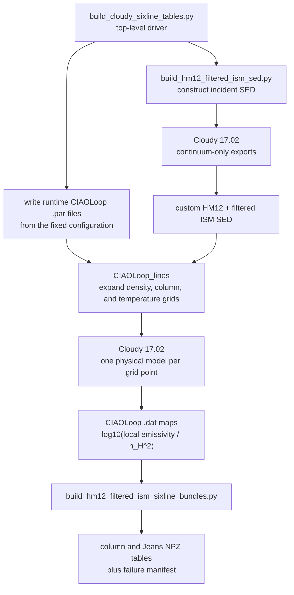

# Building the Cloudy six-line tables

This document describes the portable workflow used to build the current
Cloudy lookup tables. A fresh clone does not need the author's directory
layout and does not read any file under an old `work/` checkout.

## 1. Required software

- Cloudy 17.02, compiled on the machine that will build the tables;
- Python 3.10 or newer;
- NumPy and Matplotlib;
- Perl, used by the vendored `CIAOLoop_lines` driver.

Install the repository's Python environment with:

```bash
git clone https://github.com/bcTiann/quokka_postprocess_3D.git
cd quokka_postprocess_3D
python -m pip install -r requirements.txt
python -m pip install -e .
```

Cloudy itself is not bundled. Pass its executable explicitly or set
`CLOUDY_EXE`:

```bash
export CLOUDY_EXE=/path/to/cloudy/c17.02/source/cloudy.exe
test -x "$CLOUDY_EXE"
```

## 2. Quick start

First run the one-point smoke test. It builds the incident radiation field,
writes a portable CIAOLoop parameter file, and evaluates all six lines at
one `(n_H,N_H,T)` point:

```bash
python scripts/build_cloudy_sixline_tables.py \
  --cloudy-exe "$CLOUDY_EXE" \
  --smoke-only
```

If the smoke test succeeds, build both production tables:

```bash
python scripts/build_cloudy_sixline_tables.py \
  --cloudy-exe "$CLOUDY_EXE" \
  --workers 11 \
  --force
```

`--workers` controls the maximum number of simultaneous local Cloudy
processes. Start with a value appropriate for the machine. `--force`
replaces generated runtime outputs and final table products; it does not
modify source templates.

The final products are:

```text
data/cloudy_hm2012_native_plus_filtered_ism_cmb_cr_mol_ct_defaultabund_sixline_column_10x10x21.npz
data/cloudy_hm2012_native_plus_filtered_ism_cmb_cr_mol_ct_defaultabund_sixline_jeans_10x21.npz
data/cloudy_hm2012_native_plus_filtered_ism_cmb_cr_mol_ct_defaultabund_sixline_failure_nodes.json
```

Generated SEDs, CIAOLoop parameter files, raw CIAOLoop maps, and logs are
kept under:

```text
runtime/cloudy_sixline/
```

Both `runtime/` and `data/` are ignored by Git because they are generated
products, not source files.

## 3. Call structure and division of responsibility

The workflow has four layers. Cloudy is called in two different places for
two different purposes; CIAOLoop is involved only in the line-grid stage.



### 3.1 Top-level builder

`scripts/build_cloudy_sixline_tables.py` is the user-facing command. It does
not calculate atomic populations itself. It validates paths, creates the
runtime directory, calls the SED builder, writes the CIAOLoop parameter files,
runs CIAOLoop, and finally calls the NPZ bundle builder.

### 3.2 Incident-radiation builder calls Cloudy directly

`scripts/build_hm12_filtered_ism_sed.py` calls Cloudy directly, without
CIAOLoop, for four small continuum-only calculations:

1. export `table HM12 redshift 0`;
2. export unfiltered `table ISM` for diagnostics;
3. export `table ISM` after `extinguish column=21 leak=0`;
4. ask Cloudy to read and re-export the combined custom SED as a round-trip
   verification.

The dummy gas commands used for these exports (`hden -10`, fixed
$10^4\,$K, `stop zone 1`) only allow Cloudy to complete the continuum export.
They are not the gas conditions used in the line tables.

### 3.3 CIAOLoop constructs the line-emissivity grid

After the SED exists, the top-level builder invokes the vendored
`CIAOLoop_lines`. CIAOLoop reads a rendered `.par` file and expands its loop
commands.

For the column table, each Cloudy model receives one density and one stopping
column:

```text
hden <log10 n_H>
stop column density <log10 N_H>
```

There are $10\times10=100$ such maps. Within each map, CIAOLoop runs Cloudy
once at each of the 21 fixed temperatures, for 2100 column-table Cloudy
models.

For the Jeans table, each map receives one density. At every temperature,
CIAOLoop calculates

$$
L_J=\pi\left(\frac{\gamma k_B}{Gm_H}\right)^{1/2}
\left(\frac{T}{\rho}\right)^{1/2},
$$

using $X_H=0.76$ and $\mu=1$, caps it at 100 pc, and adds

```text
radius 1e30 <L_J in cm> linear
```

to impose that slab thickness. The Jeans grid therefore contains
$10\times21=210$ Cloudy models.

For one column-grid point, the effective Cloudy input has the following
structure (the numerical loop values change from point to point):

```text
iterate to convergence
stop temperature off
set WeakHeatCool -20
cosmic rays rate -16.698970

table SED "HM12_NATIVE_ISM_NH21/z_0.0000e+00.sed"
f(nu) = -22.0006176315 at 1 Ryd
CMB redshift 0

hden <log10 n_H>
stop column density <log10 N_H>
constant temperature <T in K> K linear

save last lines, emissivity "<temporary line file>"
C  2 157.636m
H  1 6562.81A
H  1 21.1207c
C  3 977.020A
C  3 1906.68A
C  3 1908.73A
end of lines
punch last physical conditions file = "<temporary conditions file>"
```

The temperature is imposed rather than solved from thermal equilibrium.
At fixed $(n_H,N_H,T)$ or $(n_H,T,L_J)$, Cloudy solves the ionization,
chemistry, level populations, attenuation through the slab, and line
emissivities while iterating the state to convergence.

### 3.4 What CIAOLoop extracts from Cloudy

Cloudy divides the slab into zones. The `save last lines, emissivity` output
contains a local volume emissivity for every zone, in
$\mathrm{erg\,s^{-1}\,cm^{-3}}$. The modified `CIAOLoop_lines` parser reads
the final row, so the table value represents the local emissivity in the
deepest (last) zone, not the luminosity integrated through the full slab.

CIAOLoop also reads the hydrogen density from the last physical-conditions
row and stores

$$
\log_{10}\left(\frac{\epsilon_{\rm line,last}}{n_{H,\rm last}^2}\right),
$$

with units of $\mathrm{erg\,s^{-1}\,cm^3}$. This produces one row per
temperature in each CIAOLoop `.dat` map.

### 3.5 Bundle builder

`scripts/build_hm12_filtered_ism_sixline_bundles.py` does not call Cloudy. It
parses the completed `.dat` maps, verifies their axes and ordering, converts
the logarithmic coefficients to linear values, preserves failures, attaches
metadata, and writes the two NPZ tables and JSON failure manifest.

## 4. Physical model

The radiation incident on the illuminated face of each Cloudy calculation is

$$
J_\nu^{\rm surface}
=J_\nu^{\rm HM12,Cloudy}(z=0)
+T_\nu(N_{\rm H,fg}=10^{21}\,{\rm cm^{-2}},\mathrm{leak}=0)
J_\nu^{\rm ISM}
+J_\nu^{\rm CMB}(z=0).
$$

The components are:

- Cloudy's native `table HM12 redshift 0` spectrum;
- Cloudy's Black (1987) `table ISM` spectrum after foreground filtering with
  `extinguish column=21 leak=0`;
- `CMB redshift 0`.

The foreground extinction must be applied to the ISM component before it is
combined with HM2012. Placing `extinguish` after both spectra in one Cloudy
input would attenuate HM2012 as well, which is not the adopted model.

The other production settings are:

```text
Cloudy version                 17.02
element abundances             Cloudy defaults
H cosmic-ray ionization rate   2e-17 s^-1
molecular chemistry            enabled
charge transfer                enabled
grains                         not added
turbulence                     not added
temperature grid               3.6 K to 1e9 K, 21 log-spaced samples
density grid                   log10(n_H/cm^-3) = -4.7142857 to 6, 10 samples
column grid                    log10(N_H/cm^-2) = 15 to 24, 10 samples
maximum Jeans length           100 pc
```

Molecular chemistry and charge transfer are enabled by retaining Cloudy's
defaults: the production inputs do not issue `no H2 molecule` or
`no charge transfer`.

## 5. Lines and table axes

All six lines are calculated in each Cloudy solution:

```text
C  2 157.636m
H  1 6562.81A
H  1 21.1207c
C  3 977.020A
C  3 1906.68A
C  3 1908.73A
```

The column-density table has axes:

```text
(line, log_nH, log_NH, log_T) = (6, 10, 10, 21)
```

The Jeans-length table has axes:

```text
(line, log_nH, log_T) = (6, 10, 21)
```

For the Jeans table, CIAOLoop computes the attenuation length from the local
density and fixed temperature and caps it at 100 pc. For the column table,
Cloudy is stopped at each explicitly tabulated `N_H`.

## 6. CIAOLoop parameter files

There is no separate `.par.in` template layer. The fixed line list, radiation
commands, physical settings, and grid axes are defined in
`scripts/build_cloudy_sixline_tables.py`. At runtime that script combines the
fixed configuration with the two paths that are only known on the current
machine:

```text
cloudyExe   Cloudy executable supplied with --cloudy-exe
outputDir   generated output directory under runtime/cloudy_sixline
```

It writes three actual CIAOLoop input files under
`runtime/cloudy_sixline/examples/grackle/`: one smoke test, one column-density
grid, and one Jeans-length grid. These generated `.par` files are the exact
files read by `CIAOLoop_lines`; the final NPZ metadata records their filenames
and SHA256 hashes.

## 7. Incident SED construction

The builder exports the two adopted non-CMB components with Cloudy 17.02
`save incident continuum`. On Cloudy's common energy grid it computes

$$
(\nu 4\pi J_\nu)_{\rm combined}
=(\nu 4\pi J_\nu)_{\rm HM12}
+(\nu 4\pi J_\nu)_{\rm ISM,filtered}.
$$

The result is written to:

```text
runtime/cloudy_sixline/examples/grackle/HM12_NATIVE_ISM_NH21/z_0.0000e+00.sed
```

The production parameter files read it with:

```text
command table SED "HM12_NATIVE_ISM_NH21/z_0.0000e+00.sed"
command f(nu) = -22.0006176315 at 1 Ryd
command CMB redshift 0
```

`f(nu)` fixes the absolute intensity of the tabulated SED at 1 Ryd. It is
derived from the native Cloudy HM12 export; it is not a normalization to unity
and does not arbitrarily rescale the field. The CMB is added as a separate
Cloudy continuum component.

The builder then asks Cloudy to export the custom SED again. This round-trip
comparison verifies that Cloudy reads the written spectrum with the intended
shape and absolute scale.

## 8. Failure handling and validation

A CIAOLoop value of `-99` means that Cloudy returned zero emissivity and is
converted to an exact physical zero. A missing or crashed grid row remains
`NaN` and is marked in `failure_mask`. The bundle builder never silently
fills a failed node.

For the reference production run, the union masks contained:

```text
column table   8 failed grid nodes
Jeans table   23 failed grid nodes
```

The failure manifest records every failed coordinate. These counts are a
reference, not a reason to overwrite a different result: a user should
inspect the generated JSON and investigate if the failure pattern changes.

The table files also store:

- Cloudy version and radiation-field description;
- abundance, CMB, cosmic-ray, molecular, and charge-transfer metadata;
- portable parameter-template name and SHA-256 hash;
- raw logarithmic emissivity, linear emissivity, zero mask, and failure mask.

## 9. Simulation sampling is a separate validation step

Generating the tables does not require a QUOKKA snapshot or a DESPOTIC table.
Those inputs are needed only to determine whether a particular simulation
interpolation stencil touches a failed Cloudy node and to generate spectra.

For the reference `plt0655228` snapshot, all 134,217,728 cells were inside both
table domains and no interpolation stencil touched a failed node. The lookup
temperature policy used for that downstream analysis was:

```text
split by T_QUOKKA at 3000 K
below 3000 K: use T_DESPOTIC for Cloudy lookup and thermal width
at/above 3000 K: use T_QUOKKA
```

This downstream result validates the tables for that snapshot; it is not part
of the table-generation command above.
