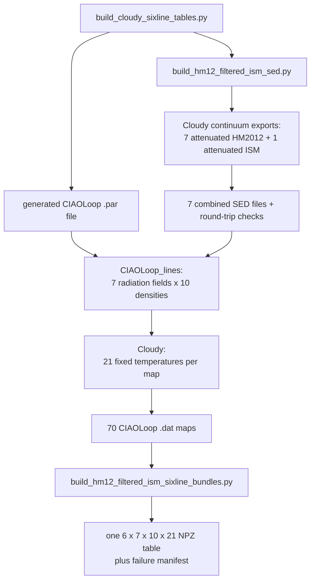

# Building the Cloudy six-line Jeans table

This document describes the current portable workflow. It builds seven
Cloudy line-emissivity tables that differ only in the foreground column used
to attenuate HM2012, then packages them as one lookup table with axes
$(N_H,n_H,T)$.

## 1. Required software

- Cloudy 17.02;
- Python 3.10 or newer with the repository environment;
- Perl;
- the vendored `cloudy_cooling_tools/CIAOLoop_lines`.

Cloudy is not bundled. Supply its executable explicitly:

```bash
export CLOUDY_EXE=/path/to/cloudy/c17.02/source/cloudy.exe
test -x "$CLOUDY_EXE"
```

All commands below are run from the repository root.

## 2. Incident radiation fields

Seven incident fields are constructed. For field $i$,

$$
J_\nu^{\rm inc}(N_{H,i})
=J_\nu^{\rm HM12,attenuated}(N_{H,i})
+J_\nu^{\rm ISM,attenuated}(10^{21}\,{\rm cm^{-2}})
+J_\nu^{\rm CMB},
$$

where

$$
\log_{10}\!\left(\frac{N_{H,i}}{{\rm cm^{-2}}}\right)
=18,18.5,19,19.5,20,20.5,21.
$$

The HM2012 and Black (1987) `table ISM` components are attenuated in
separate Cloudy continuum-only calculations using `extinguish ... leak=0`.
Their exported intensities are then added. This separation is necessary
because placing both components before one `extinguish` command would filter
both with the same column. The CMB is not written into the custom SED; it is
added later with `CMB redshift 0` in every line-emission calculation.

The seven $N_H$ values in this equation are foreground attenuation columns.
They are not Cloudy stopping columns. The emitting Cloudy slab thickness is
set separately from the Jeans length.

## 3. Quick start

First build and validate the seven incident SEDs, then run one
$(n_H,T)=(1\,{\rm cm^{-3}},10^4\,{\rm K})$ Cloudy model for each SED:

```bash
MPLCONFIGDIR=/private/tmp/quokka_mpl_cache \
conda run -n quokka python scripts/build_cloudy_sixline_tables.py \
  --cloudy-exe "$CLOUDY_EXE" \
  --workers 7 \
  --smoke-only \
  --force
```

After the smoke test succeeds, build the full table:

```bash
MPLCONFIGDIR=/private/tmp/quokka_mpl_cache \
conda run -n quokka python scripts/build_cloudy_sixline_tables.py \
  --cloudy-exe "$CLOUDY_EXE" \
  --workers 11 \
  --force
```

`--force` replaces only this workflow's generated runtime and final table
outputs. It does not modify source files.

## 4. Call structure



The top-level script is the user-facing entry point. It calls Cloudy directly
only while constructing the incident SEDs. It then writes the actual `.par`
file and passes that file to the vendored `CIAOLoop_lines`, which runs the
line-emission grid. Finally it calls the bundle builder.

## 5. SED construction and normalization

For each attenuation column, the SED builder exports

```text
table HM12 redshift 0
extinguish column=<18 ... 21> leak=0
save incident continuum "..."
```

It separately exports

```text
table ISM
extinguish column=21 leak=0
save incident continuum "..."
```

The two components are added in linear $\nu4\pi J_\nu$ units. Cloudy's
`table SED` format requires strictly positive tabulated values, so an exact
zero is serialized at six dex below that SED's smallest positive value. This
is only a file-interface floor; the exported physical component arrays retain
their exact zeros.

Each SED has a command of the form

```text
f(nu) = <calculated value> at 0.5 Ryd
```

The value is calculated from that SED's actual intensity at 0.5 Ryd. It is
not an arbitrary non-zero number. Changing the anchor energy is harmless only
when the corresponding value is recalculated from the same target SED.

Cloudy then reads and re-exports every custom SED. The build stops if the
round-trip error exceeds $10^{-3}$ dex over the part of the spectrum within
30 dex of its peak. Full-range and relevant-range errors are both stored in
`build_report.json`.

## 6. CIAOLoop line grid

The generated production `.par` file loops over:

```text
loop [hden] <10 values from log10 n_H = -4.7142857 to 6>
loop [init "HM12_ATTENUATION_ISM_NH21/logNH*.out"] \
  18 18.5 19 19.5 20 20.5 21
```

This gives 70 CIAOLoop maps. Each map contains 21 fixed temperatures from
3.6 K to $10^9$ K, for 1470 Cloudy temperature points in total.

For every $(n_H,T)$ point, the modified line-map mode calculates a Jeans
length and caps it at 100 pc. It then adds

```text
radius 1e30 <Jeans length in cm> linear
```

to set the emitting slab thickness. There is no `stop column density` loop in
this table.

The other fixed settings are:

```text
Cloudy version                 17.02
element abundances             Cloudy defaults
H cosmic-ray ionization rate   2e-17 s^-1
CMB                            redshift 0
molecular chemistry            Cloudy default simple network
charge transfer                Cloudy default, enabled
grains                         not added
turbulence                     not added
maximum Jeans length           100 pc
```

The six lines are:

```text
C  2 157.636m
H  1 6562.81A
H  1 21.1207c
C  3 977.020A
C  3 1906.68A
C  3 1908.73A
```

## 7. What is stored

Cloudy divides each Jeans slab into zones. `CIAOLoop_lines` reads the final
row from `save last lines, emissivity`, so the stored quantity is the local
emissivity in the deepest Cloudy zone, not luminosity integrated through the
whole slab. It stores

$$
\log_{10}\!\left(
\frac{\epsilon_{\rm line,last}}{n_{H,\rm last}^{2}}
\right)
$$

in $\mathrm{erg\,s^{-1}\,cm^3}$.

The packaged table has

```text
axis order = (line, log_NH_attenuation, log_nH, log_T)
shape      = (6, 7, 10, 21)
```

The final generated products are:

```text
data/cloudy_hm2012_attgrid_ism_nh21_cmb_cr_defaultabund_sixline_jeans_7x10x21.npz
data/cloudy_hm2012_attgrid_ism_nh21_cmb_cr_defaultabund_sixline_jeans_failure_nodes.json
```

The SEDs, generated parameter files, raw maps, and logs are under
`runtime/cloudy_sixline/`. Generated products are ignored by Git.

## 8. Failure handling and simulation lookup

A CIAOLoop value of `-99` is a true zero emissivity and becomes an exact zero
in the linear table. A missing or crashed row remains unavailable in
`failure_mask`; the bundle builder never fills it.

For simulation lookup:

1. cells are split using $T_{\rm QUOKKA}=3000$ K;
2. below 3000 K, $T_{\rm DESPOTIC}$ is used for Cloudy lookup and thermal
   broadening;
3. at or above 3000 K, $T_{\rm QUOKKA}$ is used;
4. the default simulation column is the harmonic mean of the $+z$ and $-z$
   cumulative columns;
5. $N_H<10^{18}\,{\rm cm^{-2}}$ is clipped to $10^{18}\,{\rm cm^{-2}}$;
6. $N_H>10^{21}\,{\rm cm^{-2}}$ is clipped to $10^{21}\,{\rm cm^{-2}}$;
7. $N_H$ is never extrapolated, while out-of-range $n_H$ or $T$ is an error.

Before accumulating any spectrum, the spectrum script scans the complete
simulation stencil. It writes a preflight JSON containing the lower/upper
$N_H$ clipping counts, failure touches for each line, their union, and the
maximum failure weight. Spectrum generation proceeds only when no failed node
has interpolation weight greater than $10^{-12}$.

After the production table exists, run for example:

```bash
MPLCONFIGDIR=/private/tmp/quokka_mpl_cache \
conda run -n quokka python \
  scripts/plot_hm12_filtered_ism_sixline_spectra.py \
  --los y \
  --workers 11 \
  --force
```
