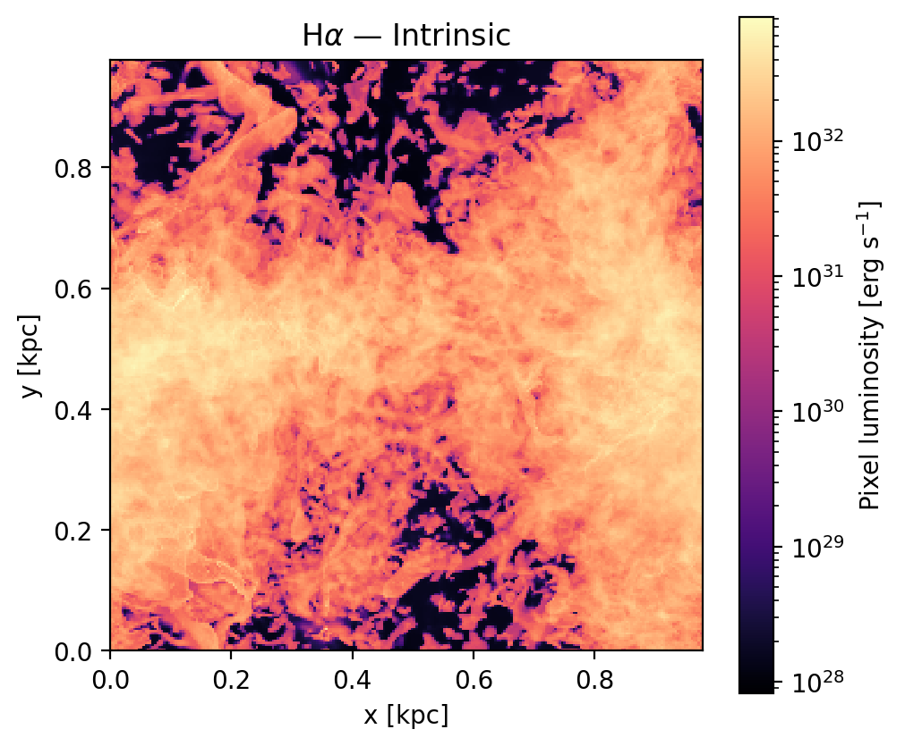
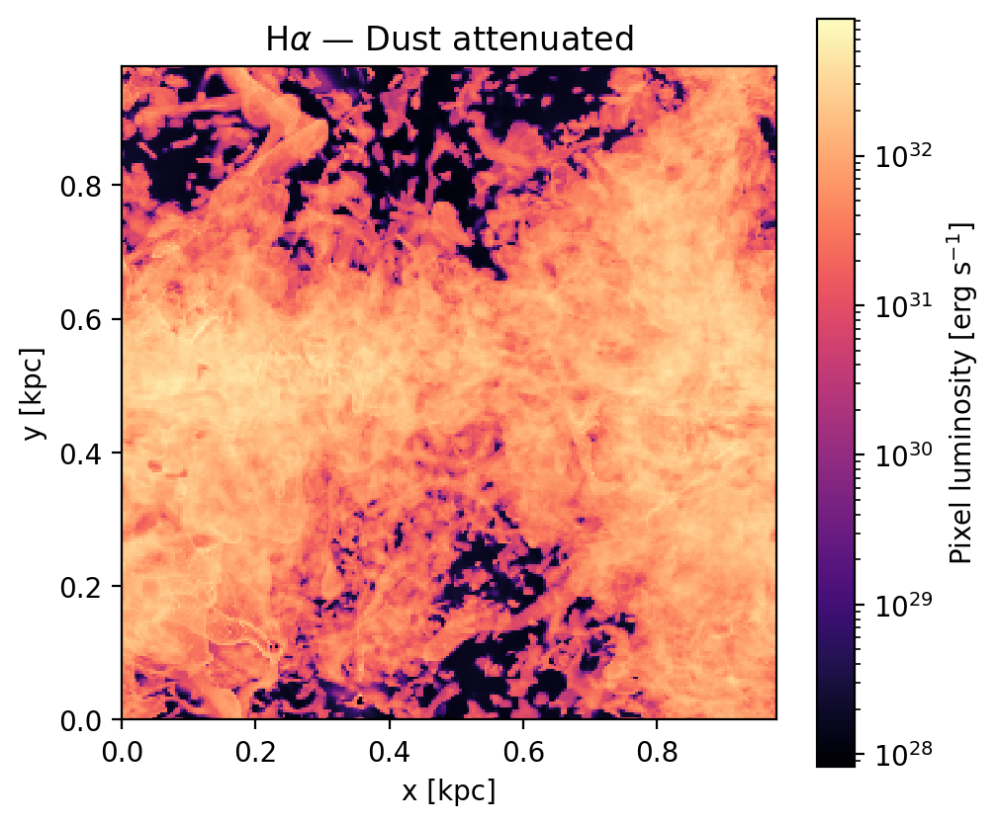
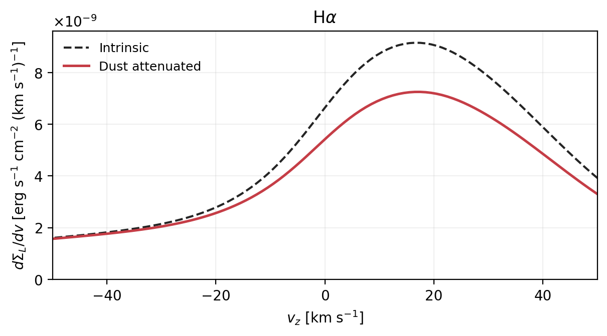

# quokka2s — QUOKKA emission post-processing

## 1. Clone

```bash
git clone https://github.com/bcTiann/quokka_postprocess_3D.git
cd quokka_postprocess_3D
```

## 2. Configure the environment

Create a Conda environment with Python 3.11, the version used to validate this pipeline:

```bash
conda create -n quokka2s python=3.11 pip
conda activate quokka2s
python -m pip install -r requirements.txt
python -m pip install -e .
```

## 3. Set the inputs

Default input locations, relative to the repository root:

| Input | Default path | Provided by |
|---|---|---|
| Simulation snapshot | `inputs/snapshots/plt0655228/` | The user |
| DESPOTIC table | `inputs/tables/despotic/interpolated.npz` | Included in Git |
| Cloudy table | `inputs/tables/cloudy/emission.npz` | Included in Git |

Place the complete snapshot directory at `inputs/snapshots/plt0655228/`,
including `Header`, `metadata.yaml`, and its data subdirectories.
For another snapshot name, update `dataset` in
[configs/emission_process.yaml](configs/emission_process.yaml).

Default inputs and outputs stay inside this clone. YAML paths are relative
to the configuration file: `../inputs/` refers to this repository's `inputs/`.
The program reads the specified files; it does not search outside the repository
for replacement inputs.
The bundled tables are for the `plt0655228` reference snapshot.

## 4. Process

Run from the repository root:

```bash
python -m quokka2s.process_snapshot
```

Settings: [configs/emission_process.yaml](configs/emission_process.yaml).
Results: `output/plt0655228/processed/`.
For another run, choose a new `output_dir` in the process config.

## 5. Plot

```bash
python -m quokka2s.plot_emission_results
```

Settings: [configs/emission_plot.yaml](configs/emission_plot.yaml).
The default `products` path reads `output/plt0655228/processed/`.
Process saves the numerical arrays, normalization and colour limits; plot
reads them to draw. Optional image-resolution preparation is described in
the [usage guide](docs/usage.md#plot-settings).

Figures: `output/plt0655228/figures/` and
`output/plt0655228/figures_titled/`, each with `png/` and `pdf/` subdirectories.

## Example outputs

Hα luminosity images for the complete `plt0655228` snapshot, viewed along
the z axis. Both images use the same colour scale.

| Intrinsic | Dust attenuated |
|---|---|
|  |  |

Integrated Hα spectrum before and after dust attenuation:



## Repository structure

```text
configs/       Process and plot settings
src/quokka2s/  Snapshot reading, emission calculations and plotting
inputs/        Simulation snapshots and lookup tables
output/        Processed data and generated figures
tools/         Table-building tools and additional figures
vendor/        External code and reference data
docs/          Usage, methods, code guide and example images
```

[Detailed usage](docs/usage.md) · [Methods](docs/emission_method.md) ·
[Code guide](docs/code_walkthrough.md)
